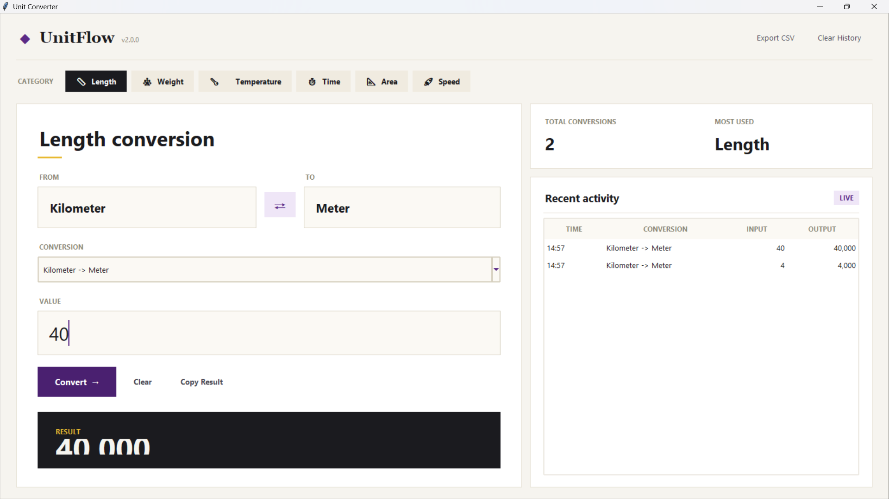
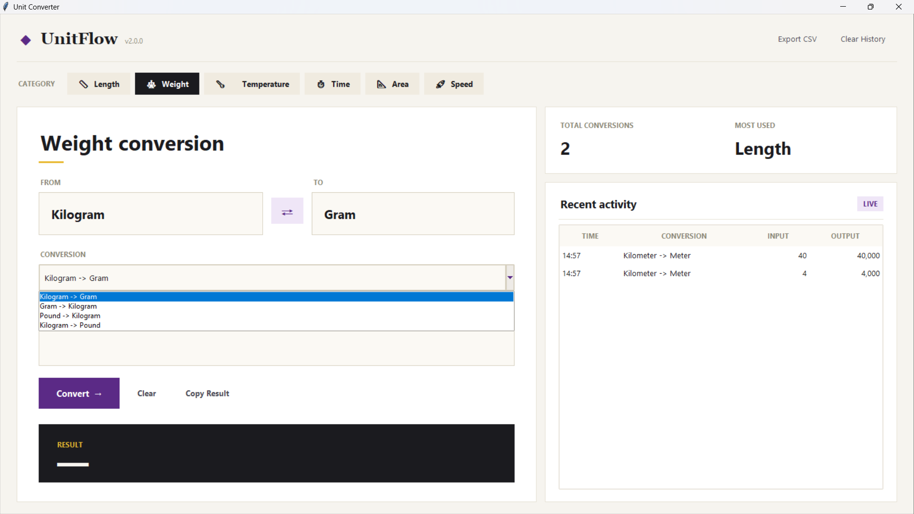
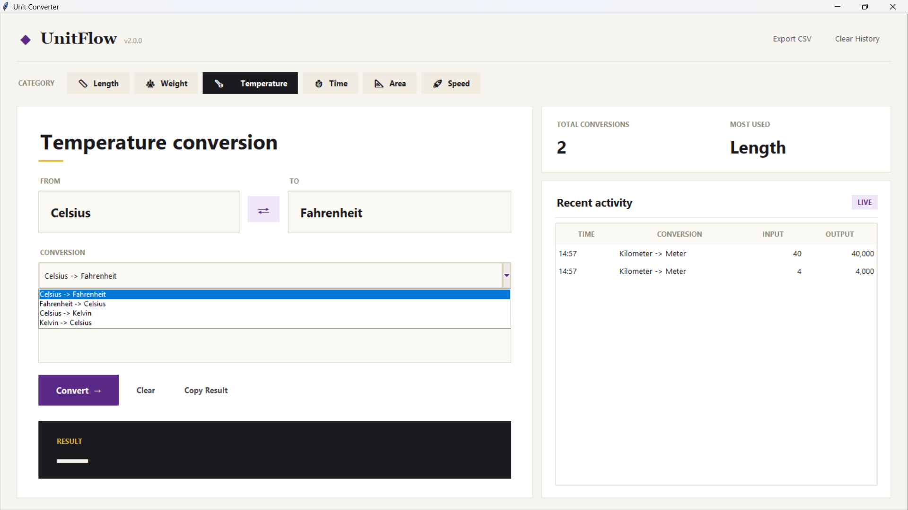
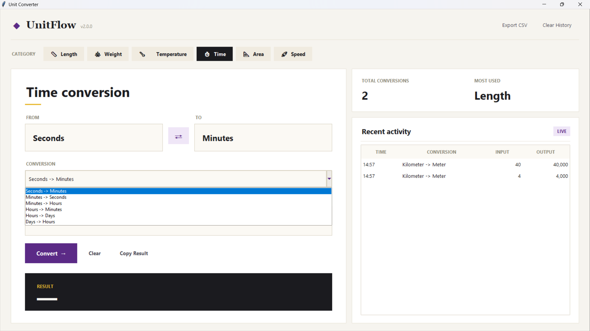
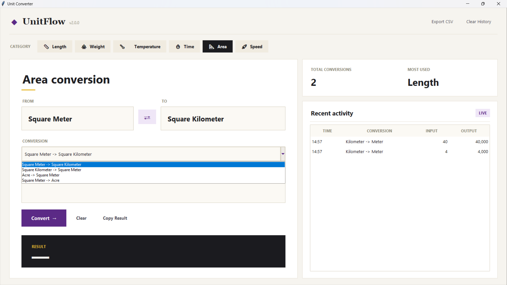
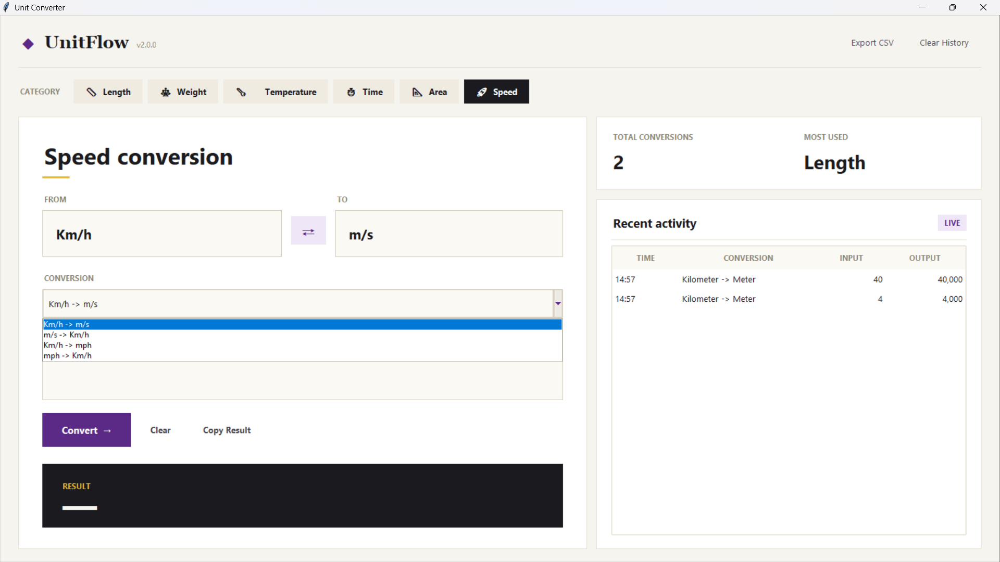

# ⚡ Unit Converter Tool (UnitFlow)

A modern desktop-based Unit Converter application developed using **Python 3** and **Tkinter**. The application provides fast and accurate unit conversions across multiple categories while maintaining conversion history and export functionality.

---

## Intern Details

| Field | Details |
|---------|---------|
| Project Name | Unit Converter Tool (UnitFlow) |
| Intern Name | Santosh Kumar Behera |
| Intern ID | CITS2854 |
| Domain | Python Programming |
| Duration | 6 Weeks |
| Organization | CODTECH IT Solutions Pvt. Ltd. |
| Internship Period | 06 June 2026 – 18 July 2026 |

---

## Project Overview

The Unit Converter Tool is designed to perform quick and accurate unit conversions through a user-friendly desktop interface. The application supports multiple conversion categories and maintains conversion history for future reference.

### Project Objectives

- Develop a professional desktop application using Python.
- Implement multiple unit conversion categories.
- Store conversion history using JSON.
- Export conversion records to CSV.
- Demonstrate GUI development using Tkinter.
- Apply software engineering best practices.

---

## Features

### Conversion Categories

- Length Conversion
- Weight Conversion
- Temperature Conversion
- Time Conversion
- Area Conversion
- Speed Conversion

### Conversion Tools

- Instant Unit Conversion
- Swap Units
- Copy Result
- Clear Input
- Accurate Calculations

### Data Management

- Conversion History
- JSON Storage
- CSV Export
- Automatic Data Saving

### User Interface

- Modern Desktop Design
- Clean Navigation
- Responsive Layout
- User-Friendly Controls
- Input Validation

---

## Technologies Used

| Category | Technology |
|-----------|------------|
| Language | Python 3 |
| GUI Framework | Tkinter |
| Data Storage | JSON |
| Export Format | CSV |
| Libraries | tkinter, json, csv, datetime, os |
| IDE | Visual Studio Code |
| Version Control | Git & GitHub |

---

## Folder Structure

```text
Unit-Converter-Tool/
│
├── .gitignore
├── main.py
├── README.md
├── requirements.txt
│
├── assets/
│   └── icons/
│       └── .gitkeep
│
├── data/
│   ├── history.json
│   └── history.csv
│
├── documentation/
│   ├── PROJECT_DOC.md
│   └── USER_MANUAL.md
│
└── screenshots/
    ├── area.png
    ├── length.png
    ├── speed.png
    ├── temperature.png
    ├── time.png
    └── weight.png
```

---

## Installation

### Clone Repository

```bash
git clone https://github.com/santoshbehera01/Unit-Converter-Tool.git
cd Unit-Converter-Tool
```

### Run Application

```bash
python main.py
```

---

## Usage

1. Open the application.
2. Select a conversion category.
3. Enter the value to convert.
4. Select source and target units.
5. Click Convert.
6. View the result instantly.
7. Save, review, or export conversion history.

---

## Screenshots

### Length Conversion



### Weight Conversion



### Temperature Conversion



### Time Conversion



### Area Conversion



### Speed Conversion



---

## Documentation

Detailed documentation is available in:

```text
documentation/
├── PROJECT_DOC.md
└── USER_MANUAL.md
```

---

## Future Enhancements

- Dark Mode
- Additional Conversion Categories
- Advanced Statistics
- Unit Favorites
- Multi-Language Support
- Enhanced UI Themes

---

## Learning Outcomes

This project helped in understanding:

- Python Programming
- GUI Development with Tkinter
- JSON File Handling
- CSV Export Operations
- Input Validation
- Software Documentation
- Git & GitHub Workflow

---

## Author

**Santosh Kumar Behera**

Intern ID: CITS2854

Python Programming Intern

CODTECH IT Solutions Pvt. Ltd.

---

## License

This project was developed for educational and internship purposes under the CODTECH IT Solutions Pvt. Ltd. Python Programming Internship Program.